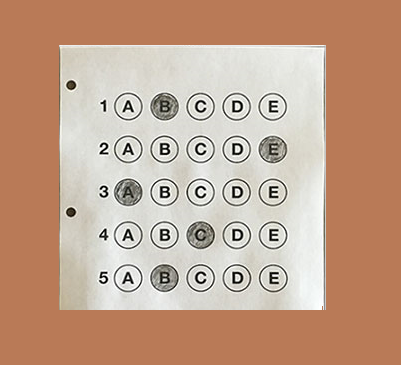
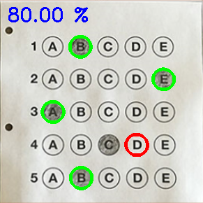
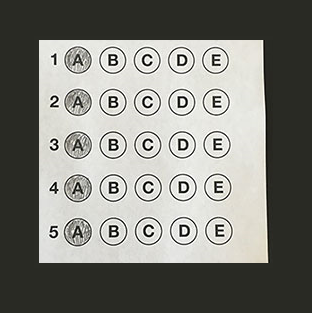
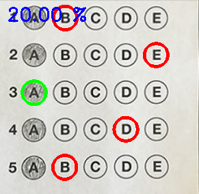

# Bubble sheet grader
[Inspiration](https://www.pyimagesearch.com/2016/10/03/bubble-sheet-multiple-choice-scanner-and-test-grader-using-omr-python-and-opencv/)

This project uses OpenCV library in python to grade answers filled in bubble sheet. 

Following are the steps that are taken to grade answers from the sheet:
+ Read image
+ Transform image to top-down view
+ Detect bubbled circles in answer sheet
+ Grade bubbled ones with the provided answer key

## How to run the program?
1. Clone the repo using command:  
`git clone https://github.com/peeush-agarwal/week-based-learning.git`
2. Change directory to `BubbleSheetOmr` using command:  
`cd week-based-learning\Projects\BubbleSheetOMR`
3. Make sure you have required libraries installed in active environment:  
`pip install -r requirements.txt`
4. Run following command:  
`python .\main.py -i .\Data\Input\Sheet-1.png -o .\Data\Output\Sheet-1-output.png`
5. This should display 2 windows:
   + Original image
   + Final image with 
     + Percentage of answers correct
     + Correct answers marked as green
     + Wrong answers marked as red
6. You can find the output image in specified directory.

## Examples

**Input** | **Output**
:---: | :---:
 | 
 | 